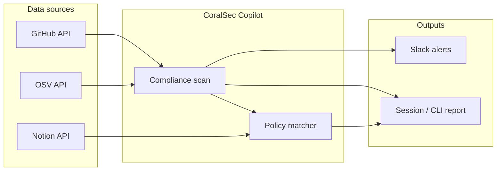

# CoralSec Copilot

**Security & Compliance Monitor** — GitHub + Slack + Notion + OSV

CoralSec Copilot is a **Unified Enterprise Security Operations Center (SOC)**—not just a CLI utility. Built on [Coral Protocol](https://docs.coralprotocol.org), it replaces fragile ETL pipelines and hand-rolled glue code with **Coral MCP** and **read-only, cross-source SQL**: operators issue a single query with **`LEFT JOIN`** semantics across **GitHub**, **Slack**, **Notion**, and **OSV** to correlate vulnerabilities, operational channels, and policy context in one execution path.

The platform surfaces risky access changes, secrets in commits, and cross-references findings with [OSV](https://osv.dev) CVE data and internal Notion policy docs. Alerts can be delivered to Slack.

## Enterprise UI

**Day 3** ships a persistent **Next.js 15** dashboard with **shadcn/ui**, organized into four modules:

| Module | Purpose |
|--------|---------|
| **Global Risk Dashboard** | Live risk score and aggregated posture signals |
| **Secret Scanner** | Visualizes leaked **AWS** / **PAT** patterns from commit and scan pipelines |
| **Vulnerability Intelligence** | Interactive **OSV / CVE** and Dependabot-aligned dependency tracking |
| **Compliance Monitor** | Ledger comparing **GitHub admin/collaborator** access to **Notion SOC2** policy pages |

The dashboard complements—not replaces—the Python CLI and Coral agent workflows documented below.

## Advanced AI Agent & Resiliency

**Master JOIN** — The natural-language agent correlates a **GitHub CVE** (Dependabot), the active **Slack** security/incident channel, and the matching **Notion** compliance policy in **one SQL row**, eliminating per-API orchestration scripts.

**Zero-Day Commit Parsing** — When cloud alert tables are empty, a resilient **Python / LangChain** scanner uses structured **`.invoke()`** tool calls to parse **local commit diffs** and surface historical leak patterns.

**Bulletproof API Pushdowns** — SQL is engineered for real connector behavior: Dependabot queries use **`state = 'open' OR state IS NULL`** so APIs that return **NULL severity** do not drop valid open alerts; **Notion** joins use exact **`query = 'security compliance policy'`** so Coral can push search to the Notion API.

## Capabilities

| Integration | What it does |
|-------------|-------------|
| **GitHub** | Collaborator baseline diff (new users, admin escalation), branch protection checks, commit diff secret scanning |
| **OSV** | CVE lookup by commit SHA or package version (PyPI, npm, Go, etc.) |
| **Notion** | Search internal security/compliance policy pages and map them to findings |
| **Slack** | Post ranked alerts with Block Kit formatting |

## Quick start (Local Development Dashboard)

This project requires two terminals to run the Next.js UI and the Coral MCP Engine simultaneously.

### 1. Setup Environment

```bash
cp .env.example .env
# Edit .env with your GitHub, Notion, and Slack tokens
```

### 2. Start Coral Engine

Open your first terminal in the root directory:

```bash
coral mcp studio
```

### 3. Start the Next.js Frontend

Open a second terminal:

```bash
cd frontend
npm install
npm run dev
```

Open [http://localhost:3000](http://localhost:3000) in your browser to view the live dashboard.

## Quick start

### 1. Install dependencies

```bash
uv sync
cp .env.example .env
# Edit .env with your tokens
```

### 2. One-shot scan (no Coral Server)

```bash
uv run python src/cli.py
```

Exit codes: `0` clean, `1` medium/high findings, `2` critical (secrets or critical access).

Options:

```bash
uv run python src/cli.py --lookback 30 --update-baseline --no-slack
```

### 3. Run as a Coral agent (devmode)

Start [Coral Server](https://github.com/Coral-Protocol/coral-server), then:

```bash
export CORAL_CONNECTION_URL="http://localhost:5555/devmode/<session>/sse"
uv run python src/main.py
```

Register the agent in `coral-server` via `coral-agent.toml` (see [LangChain agent template](https://github.com/Coral-Protocol/langchain-agent)).

## Environment variables

| Variable | Required | Description |
|----------|----------|-------------|
| `MODEL_API_KEY` | For agent loop | LLM provider API key |
| `GITHUB_TOKEN` | For GitHub features | PAT with `repo`, `read:org` |
| `GITHUB_OWNER` | For GitHub features | Org or user |
| `GITHUB_REPO` | For commit/repo scans | Repository name |
| `NOTION_TOKEN` | For policies | Notion integration token |
| `SLACK_BOT_TOKEN` | For alerts | Bot token with `chat:write` |
| `SLACK_CHANNEL_ID` | For alerts | Target channel ID |
| `CORAL_CONNECTION_URL` | Coral devmode | SSE URL from Coral Server |

## Agent tools

When running in Coral, the LLM can call:

- `scan_repository_compliance` — full pipeline
- `check_github_access_risk` — access-only check
- `scan_commits_for_secrets` — secret patterns in recent diffs
- `query_osv_for_commit` / `query_osv_for_package` — CVE lookup
- `search_notion_policies` — policy doc search
- `send_slack_security_alert` — manual Slack post

## Architecture



Access baselines are stored in `.baseline/collaborators.json` (gitignored) when you pass `--update-baseline`.

## Secret detection

Pattern-based scanner (redacted previews only): GitHub PATs, Slack tokens, Notion secrets, AWS-style keys, private keys, JWTs, and generic `api_key=` assignments. For production, pair with GitHub secret scanning or [gitleaks](https://github.com/gitleaks/gitleaks) in CI.

---

## Author
**Mehraan Amin** GitHub: [@CodeWithMehru](https://github.com/CodeWithMehru)

## 🌐 Live Demo (Sandbox Environment)
**Live Link:** [https://coral-security-copilot.vercel.app/](https://coral-security-copilot.vercel.app/)

> [!CAUTION]
> **Security Note:** As a cybersecurity best practice, the live Vercel deployment runs in a **Sandbox / Demo Mode** to prevent the exposure of active Personal Access Tokens (PATs) on a public domain. It allows you to freely explore the UI, UX, and AI Agent interactions. 
> To test the *Real-Time Scanning Engine*, please clone the repository, insert your own `.env` credentials, and run it locally.


## 🎥 3-Minute Video Pitch & Demo
Watch the full project walkthrough, architecture explanation, and live real-time scanning engine demonstration here:

**YouTube Link:** [https://youtu.be/B3eyJbFA0fk](https://www.youtube.com/watch?v=B3eyJbFA0fk)
