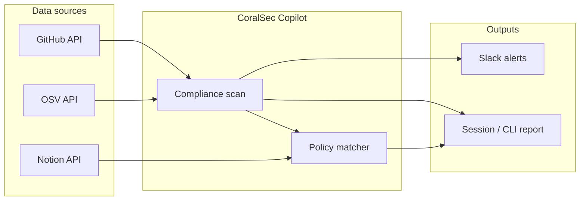

# CoralSec Copilot

**Security & Compliance Monitor** — GitHub + Slack + Notion + OSV

Enterprise security agent built on [Coral Protocol](https://docs.coralprotocol.org). It surfaces risky access changes, secrets in commits, and cross-references findings with [OSV](https://osv.dev) CVE data and internal Notion policy docs. Alerts can be delivered to Slack.

## Capabilities

| Integration | What it does |
|-------------|-------------|
| **GitHub** | Collaborator baseline diff (new users, admin escalation), branch protection checks, commit diff secret scanning |
| **OSV** | CVE lookup by commit SHA or package version (PyPI, npm, Go, etc.) |
| **Notion** | Search internal security/compliance policy pages and map them to findings |
| **Slack** | Post ranked alerts with Block Kit formatting |

## Quick start

### 1. Install dependencies

```bash
uv sync
cp .env.example .env
# Edit .env with your tokens
```

### 2. One-shot scan (no Coral Server)

```bash
uv run python src/cli.py
```

Exit codes: `0` clean, `1` medium/high findings, `2` critical (secrets or critical access).

Options:

```bash
uv run python src/cli.py --lookback 30 --update-baseline --no-slack
```

### 3. Run as a Coral agent (devmode)

Start [Coral Server](https://github.com/Coral-Protocol/coral-server), then:

```bash
export CORAL_CONNECTION_URL="http://localhost:5555/devmode/<session>/sse"
uv run python src/main.py
```

Register the agent in `coral-server` via `coral-agent.toml` (see [LangChain agent template](https://github.com/Coral-Protocol/langchain-agent)).

## Environment variables

| Variable | Required | Description |
|----------|----------|-------------|
| `MODEL_API_KEY` | For agent loop | LLM provider API key |
| `GITHUB_TOKEN` | For GitHub features | PAT with `repo`, `read:org` |
| `GITHUB_OWNER` | For GitHub features | Org or user |
| `GITHUB_REPO` | For commit/repo scans | Repository name |
| `NOTION_TOKEN` | For policies | Notion integration token |
| `SLACK_BOT_TOKEN` | For alerts | Bot token with `chat:write` |
| `SLACK_CHANNEL_ID` | For alerts | Target channel ID |
| `CORAL_CONNECTION_URL` | Coral devmode | SSE URL from Coral Server |

## Agent tools

When running in Coral, the LLM can call:

- `scan_repository_compliance` — full pipeline
- `check_github_access_risk` — access-only check
- `scan_commits_for_secrets` — secret patterns in recent diffs
- `query_osv_for_commit` / `query_osv_for_package` — CVE lookup
- `search_notion_policies` — policy doc search
- `send_slack_security_alert` — manual Slack post

## Architecture



Access baselines are stored in `.baseline/collaborators.json` (gitignored) when you pass `--update-baseline`.

## Secret detection

Pattern-based scanner (redacted previews only): GitHub PATs, Slack tokens, Notion secrets, AWS-style keys, private keys, JWTs, and generic `api_key=` assignments. For production, pair with GitHub secret scanning or [gitleaks](https://github.com/gitleaks/gitleaks) in CI.

## License

MIT
